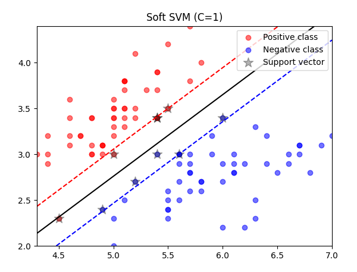
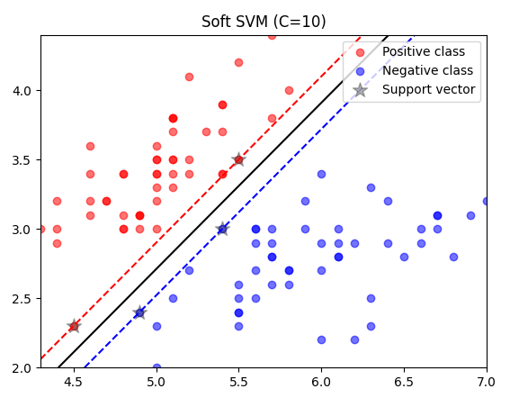

# CS461 HW3 Samples
Some code samples from Machine Learning Principles HW3, relating to Support Vector Machines, Sequential Minimal Optimization, Gaussian Discriminant Analysis, and Logistic Regression.

## P2: Support Vector Machines

This section uses an SMO-based SVM implementation (adapted from Lucien East’s reference) to classify two Iris species using soft-margin SVM with a linear kernel.

### Implementation and Plots

`train2_2.py` trains SVMs with $C=1,10,100$, and plots decision boundaries and support vectors for each model:

<p float="left" align="center">    </p>

### Margin and Support Vector Analysis

Using the final weight vector, margins are computed as $\frac{1}{||w||}$.

C | Number of Support Vectors | Size of Margin
--- | --- | ---
1 | 10 | 0.39802814029218175 
10 | 4 | 0.21095274335984554
100 | 3 | 0.2111069705051493

As C increases, the model penalizes misclassification more heavily, producing a tighter margin and fewer support vectors. A small C underfits by allowing violations; a very large C risks overfitting with a narrow margin.

## P3: Guassian Discriminant Analysis

This section implements GDA for 1D and 2D data, estimating Gaussian parameters and applying both MLE and MAP decision rules.

### 1D Classification

In `train3_1.py`, the dataset is split into positive and negative samples, the sample mean and sample variance for each class were found using `numpy`:

Class | Mean ($\mu$) | Var ($\sigma^2$)
--- | --- | ---
$+$ | −0.0721922106722285 | 1.3096715040939155
$-$ | 0.9401561132214228 | 1.9437063405522659

In `test3_2.py`, Gaussian likelihoods give us only 61.5% accuracy under equal priors.

Going back to my `train3_1.py` file, I added code to find the priors, finding that $P(pos)=0.1$ and $P(neg)=.9$, showing that we cannot assume equivalent priors. To fix this in `test3_3.py`, I modified the decision rule to incorporate the MAP rule, multiplying both likelihoods with their class priors then applying the decision rule on the posterior, yielding a 90% accuracy.

### 2D Classification

For 2D data, `train3_4.py` instead computes class mean vectors and covariance matrices:

Class    | Mean ($\vec{\mu}$)                   | COV ($\Sigma$)
---------|------------------------------|----------------------------------------------
| $+$ | [0.0130754, 0.06295251]          | [[0.98285498, 0.00612046], [0.00612046, 1.05782804]] |
| $-$ | [-0.02313942, -0.02114952]       | [[1.00329037, -0.01142356], [-0.01142356, 4.97693356]] |

Equivalent priors were also found for both classes.

To perform testing on the 2D data, I implemented a function to perform the multivariate Gaussian in `test3_5.py`:

```python
def multivariate_gaussian(variable, mean, COV) -> float:
    N = mean.shape[0]
    variable_centered = variable - mean
    norm = 1 / math.sqrt((2 * math.pi) ** N * (np.linalg.det(COV)))
    exp = -0.5 * variable_centered.T @ np.linalg.pinv(COV) @ variable_centered
    return norm * math.exp(exp)
```

Applying the GDA decision rule in 2D yields a test accuracy of 84%.

Using the true mixture distribution for the negative class in `test3_6.py` slightly improves accuracy to 85%. This shows that even when class distributions deviate from a single Gaussian, GDA still provides a solid approximation due to fitting the closest Gaussian to the data (and from CLT intuition).

## P4: Logistic Regression

This section implements a logistic regression spam classifier using only NumPy, with TF-IDF preprocessing and PCA dimensionality reduction.

### Preprocessing

The provided `P4_files/preprocessing.py` converts raw emails into a 2000-dimensional vector using TF-IDF: TF measures how often a word appears in a document. IDF decreases the weight of common words across documents. Multiplying them gives a vector reflecting word importance. TF-IDF scores are saved as a 4000x2002 matrix in `spam_ham.csv`.

`data4_2.py` loads the TF-IDF matrix as a numpy array with `numpy.genfromtxt`, then performs PCA to reduce the dimensionality from 2000D to 50D, then saves train and test splits in `P4_files/train4_2.npz` and `P4_files/test4_2.npz` respectively.

### Gradient Descent Training

The logistic regression model is implemented in `train4_3.py`. The script defines functions for the sigmoid, negative log likelihood, and gradient of the loss.

The gradient is computed as $\nabla L(w)=X^\top(\sigma(Xw)-t)$. The weights are initialized to zero and updated using batch gradient descent with a fixed step size of $1e-4$. Training continues until either 100,000 iterations are reached or the change in negative log likelihood drops below 10.

### Model Performance

After training, the model evaluates itself on the training and testing sets using the learned weights and mapping sigmoid outputs to binary classifications. The resulting accuracies were:
- Training accuracy: 96.6%
- Testing accuracy: 97.2%
This shows the PCA-compressed representation still retains enough information for strong classification performance.

### Classifying `mail.txt`

As an additional test, an example spam email `P4_files/mail.txt` is tested on the model. Additional code was added to `preprocessing.py` to vectorize `mail.txt` using the same vocabulary saving as `mail.npz`. `data4_2.py` then projects it to 50 dimensions using the same PCA eigenvectors, saving it as `mail50D.npz`.

Finally in `train4_3.py`, this vector is passed through the same trained logistic regression model, finding that it is successfully classified as spam.
